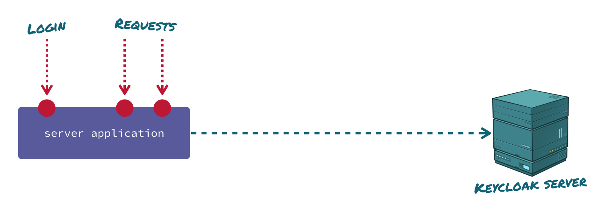

# Security sample

This examples shows how the security APIs of Dolphin Platform can be used. Since this sample concentrates on
the usage of that security API it do not contain any dynamic clients. The provided clients simply do a login
against the server and call a secure REST endpoint on the server.

## How is the security implemented?

The Dolphin Platform uses [keycloak](https://www.keycloak.org) for identity and access management. By adding
the `dolphin-platform-security-server` module to the server application a proxy servlet will be added
to the server that provides login functionallity by calling the keycloak server internally.

The security is based on OpenID connect and JWT tokens. Once a client is login it will receive a JWT security
token. The http client of the Dolphin Platform automatically adds this token to any request against the server.
By doing so secured endpoints can be called without any additional security handling after a sucessfull login.

The server receives the security token and automatically validates it against the keycloak server.

## Modules

TODO

## Start the sample

TODO

## License
The project is released as open source under the [Apache License Version 2.0](http://www.apache.org/licenses/LICENSE-2.0)

  

About Canoo

