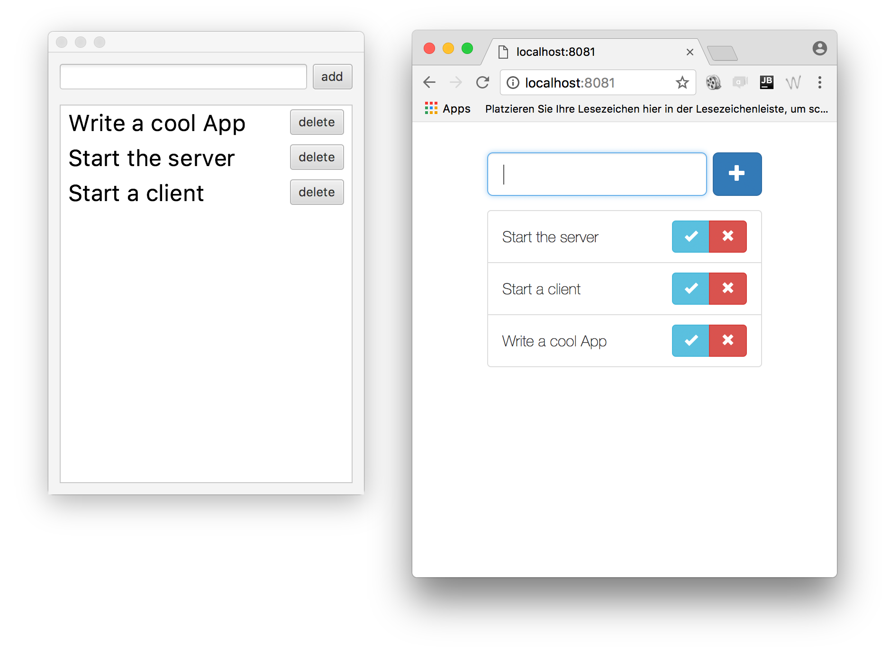

# ToDo List sample

This example contains a todo list that is shared between several clients. The sample is based on the `remoting` modules
of [Dolphin Platform](https://github.com/canoo/dolphin-platform). By doing so data can easily synchronized between
client and server.

The application provides several clients for the todo app that are all connected to the same server instance. Whenever a
todo item is added by one client it will automatically be shown by all other clients.

## Modules

TODO

## Start the sample

The sample provide a JavaEE and a Spring based server. Only one of the servers can be started since both use the
same port. The server provides the application at `http://localhost:8080/todo-app`.

Once a server is running multiple instances of the clients can be started. All clients connect to a server at
 `http://localhost:8080/todo-app`.

All modules provide a Maven target to start the application.

### JavaEE server
To start the JavaEE server simply run `mvn wildfly:run` from the `server-javaee` folder. Next to this the server can
be deployed to any JavaEE 6 application server. To do so run `mvn verify` from the `server-javaee` folder. The created
`todo-app.war` in the `target` folder can be deployed as JavaEE web application. The application must be reachable
under `http://localhost:8080/todo-app`.

### Spring Boot server
To start the Spring Boot server simply run `mvn spring-boot:run` from the `server-spring` folder. Next to this the
server can be started by the `com.canoo.dolphin.todo.server.ToDoServer` class.

### JavaFX client
To start the JavaFX client simply run `mvn jfx:run` from the `client-javafx` folder. Next to this the client can be
started by the `com.canoo.dolphin.todo.client.ToDoClient` class.

### Angular client
To start the Angular client simply run `mvn jetty:run` from the `client-angular` folder. Once this is done the client
can be reached at `http://localhost:9999`. Just open this url in any web browser.

By calling `mvn jetty:run` the following will happen:

* NPM will be installed locally in the module folder.
* `npm install` will be called in the folder. By doing so NPM will install bower
* `bower install` will be called in the folder. This will download all needed dependencies for the client.
* A Jetty instance will be started. This will host the client at `http://localhost:9999`

### Polymer client
To start the Polymer client simply run `mvn jetty:run` from the `client-polymer` folder. Once this is done the client
can be reached at `http://localhost:9999`. Just open this url in any web browser.

By calling `mvn jetty:run` the following will happen:

* NPM will be installed locally in the module folder.
* `npm install` will be called in the folder. By doing so NPM will install bower
* `bower install` will be called in the folder. This will download all needed dependencies for the client.
* A Jetty instance will be started. This will host the client at `http://localhost:9999`

## License
The project is released as open source under the [Apache License Version 2.0](http://www.apache.org/licenses/LICENSE-2.0)

  

About Canoo

